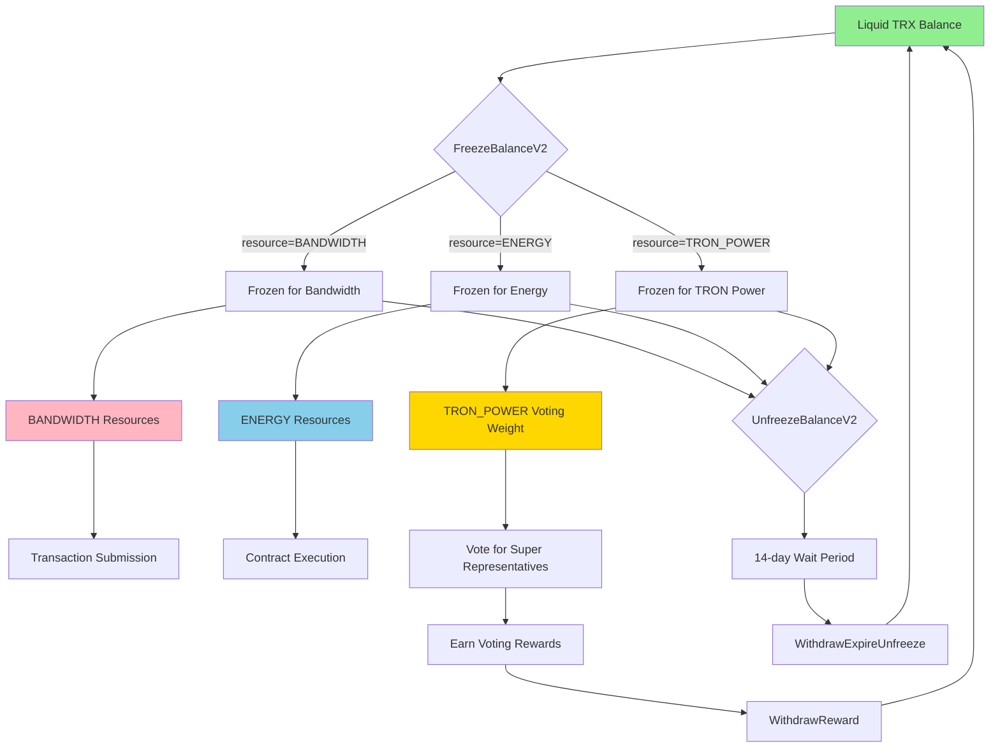
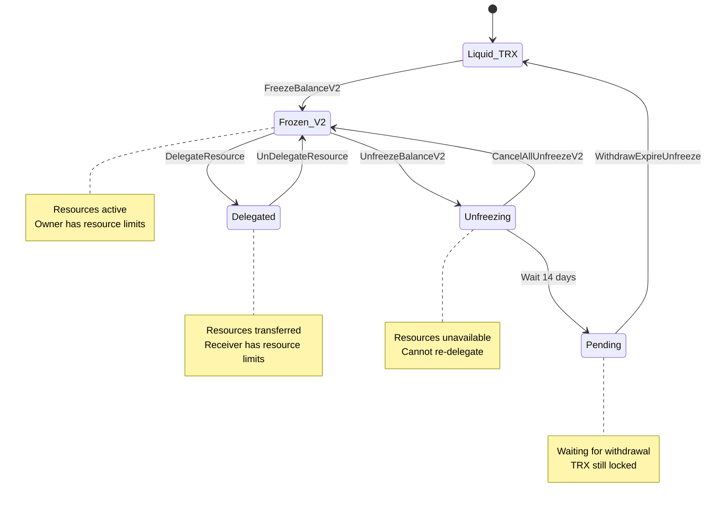

# Chapter 1: Resource Types and Architecture

> **Source**: Based on java-tron source code analysis (commit 1e35f79a1)

## 1.1 Introduction to TRON Resources

TRON blockchain implements a unique resource management system that differs fundamentally from Ethereum's gas model. Instead of burning cryptocurrency for every operation, TRON allows users to freeze TRX (the native token) to obtain resources that regenerate over time. This chapter explores the complete taxonomy of TRON resources, their architectural design, and their evolution from Stake 1.0 to Stake 2.0.

### 1.1.1 Core Philosophy

TRON's resource system is built on three key principles:

1. **Sustainable Resource Management**: Resources regenerate over a 24-hour window
2. **Capital Efficiency**: Frozen TRX can be unfrozen and reused
3. **Economic Flexibility**: Users can delegate resources to others while retaining ownership of TRX

## 1.2 Complete Resource Taxonomy

TRON defines exactly three resource types in the protocol layer. These are defined in the protobuf specification:

**Source**: `protocol/src/main/protos/core/contract/common.proto` (Lines 9-13)

```protobuf
enum ResourceCode {
  BANDWIDTH = 0x00;
  ENERGY = 0x01;
  TRON_POWER = 0x02;
}
```

### 1.2.1 BANDWIDTH (0x00)

**Purpose**: Network transaction fees for data transmission

**Characteristics**:
- **Free Daily Allocation**: 5,000 bytes per account per 24 hours
- **Consumption Rate**: 1 bandwidth unit per transaction byte
- **Acquisition**: Freeze TRX via `FreezeBalanceV2Contract` with `resource=BANDWIDTH`
- **Recovery**: Linear over 24-hour window
- **Fallback**: If insufficient, pay transaction fee (10 sun/byte default)

**Technical Details**:

The bandwidth system tracks two separate allocations per account:

1. **Free Bandwidth** (`Account.free_net_usage`): 5,000 bytes daily
2. **Frozen Bandwidth** (`Account.net_usage`): Proportional to frozen TRX

**Source Code Reference**: `chainbase/src/main/java/org/tron/core/db/BandwidthProcessor.java`

```java
// Consumption priority order
public void consume(TransactionCapsule trx, TransactionTrace trace) {
    // 1. Try account frozen bandwidth
    if (useAccountNet(account, bytes, now)) return;

    // 2. Try free daily bandwidth
    if (useFreeNet(account, bytes, now)) return;

    // 3. Fallback: pay transaction fee
    if (useTransactionFee(account, bytes, trace)) return;

    // 4. Fail: throw AccountResourceInsufficientException
    throw new AccountResourceInsufficientException();
}
```

**Calculation Formula**:

```
bandwidth_limit = (frozen_balance / 1,000,000) × (total_net_limit / total_net_weight)

Where:
- frozen_balance: TRX frozen for bandwidth (in sun)
- 1,000,000: TRX precision (1 TRX = 10^6 sun)
- total_net_limit: Global bandwidth limit (43,200,000,000 bytes/day default)
- total_net_weight: Sum of all TRX frozen for bandwidth across network
```

**Example Calculation**:

```
Scenario: User freezes 10,000 TRX for bandwidth
Network state: total_net_weight = 10,000,000,000 TRX

frozen_balance = 10,000 × 1,000,000 = 10,000,000,000 sun
weight = 10,000,000,000 / 1,000,000 = 10,000

bandwidth_limit = 10,000 × (43,200,000,000 / 10,000,000,000)
                = 10,000 × 4.32
                = 43,200 bytes every 24 hours
```

### 1.2.2 ENERGY (0x01)

**Purpose**: Smart contract execution fuel

**Characteristics**:
- **Free Daily Allocation**: None (0 units)
- **Consumption Rate**: Varies by opcode (2-32,000 energy per operation)
- **Acquisition**: Freeze TRX via `FreezeBalanceV2Contract` with `resource=ENERGY`
- **Recovery**: Linear over 24-hour window
- **Fallback**: If insufficient, burn TRX (420 sun/energy default, dynamic)
- **Adaptive Scaling**: Network can expand/contract total energy based on demand

**Technical Details**:

Energy consumption is tracked at the instruction level during contract execution. The TRON Virtual Machine (TVM) maintains an energy counter that decrements with each operation.

**Source Code Reference**: `actuator/src/main/java/org/tron/core/vm/EnergyCost.java` (Lines 42-49)

```java
// V2 Resource Operations
private static final long FREEZE_V2 = 10000;
private static final long UNFREEZE_V2 = 10000;
private static final long WITHDRAW_EXPIRE_UNFREEZE = 10000;
private static final long CANCEL_ALL_UNFREEZE_V2 = 10000;
private static final long DELEGATE_RESOURCE = 10000;
private static final long UN_DELEGATE_RESOURCE = 10000;
private static final long VOTE_WITNESS = 30000;
private static final long WITHDRAW_REWARD = 20000;
```

**Energy Tier Structure**:

| Tier | Cost | Operations |
|------|------|-----------|
| ZERO_TIER | 0 | STOP, RETURN (base cost) |
| BASE_TIER | 2 | Arithmetic operations (ADD, SUB, MUL) |
| VERY_LOW_TIER | 3 | Logical operations (AND, OR, XOR) |
| LOW_TIER | 5 | Comparison operations (LT, GT, EQ) |
| MID_TIER | 8 | Memory operations (MLOAD, MSTORE8) |
| HIGH_TIER | 10 | Complex operations (JUMPI, BLOCKHASH) |
| EXT_TIER | 20 | External data access (EXTCODESIZE) |
| SPECIAL | Variable | Operation-dependent (SSTORE, CREATE, CALL) |

**Storage Operations** (Most Expensive):

| Operation | Cost | Condition |
|-----------|------|-----------|
| SLOAD | 50 | Storage read |
| SSTORE_SET | 20,000 | Write to new slot |
| SSTORE_RESET | 5,000 | Update existing slot |
| SSTORE_CLEAR | 5,000 | Clear slot (with refund) |

**Calculation Formula**:

```
energy_limit = (frozen_balance / 1,000,000) × (total_energy_limit / total_energy_weight)

Where:
- frozen_balance: TRX frozen for energy (in sun)
- total_energy_limit: Global energy limit (180,000,000,000 energy/day default)
- total_energy_weight: Sum of all TRX frozen for energy across network
```

**Example Calculation**:

```
Scenario: User freezes 100,000 TRX for energy
Network state: total_energy_weight = 10,000,000,000 TRX

frozen_balance = 100,000 × 1,000,000 = 100,000,000,000 sun
weight = 100,000,000,000 / 1,000,000 = 100,000

energy_limit = 100,000 × (180,000,000,000 / 10,000,000,000)
             = 100,000 × 18
             = 1,800,000 energy every 24 hours
```

### 1.2.3 TRON_POWER (0x02)

**Purpose**: Governance and voting weight for Super Representative elections

**Characteristics**:
- **Voting Power**: 1 TRON_POWER = 1 vote
- **Acquisition**: Freeze TRX via `FreezeBalanceV2Contract` with `resource=TRON_POWER`
- **No Consumption**: Does not deplete over time
- **Voting Rewards**: Earn rewards from voted Super Representatives
- **Withdrawal**: Must unfreeze to convert back to liquid TRX

**Technical Details**:

Unlike BANDWIDTH and ENERGY, TRON_POWER does not have a consumption mechanism. It represents static voting power that persists until the TRX is unfrozen.

**Voting Mechanism**:

```
Total TRON_POWER = Frozen TRX Amount

Example:
Freeze 50,000 TRX → Receive 50,000 TRON_POWER → Can cast 50,000 votes
```

Users can distribute their TRON_POWER across multiple Super Representative candidates:

```
Scenario: 50,000 TRON_POWER
Vote distribution:
- SR1: 20,000 votes
- SR2: 15,000 votes
- SR3: 10,000 votes
- SR4: 5,000 votes
Total: 50,000 votes
```

**Source Code Reference**: `actuator/src/main/java/org/tron/core/vm/nativecontract/VoteWitnessProcessor.java`

**Voting Rewards**:

Super Representatives share block rewards and transaction fees with voters:

```
Voter Reward = (Your TRON_POWER / Total Votes for SR) × SR Reward Pool × Brokerage Rate

Where:
- Brokerage Rate: Percentage SR shares with voters (20% default)
- Reward Pool: 127 TRX per block for top 27 SRs
- 115 TRX per block for top 127 candidates
```

## 1.3 Resource Relationship Architecture

The three resource types are interconnected through the freeze/unfreeze mechanism:



### 1.3.1 Resource Independence

Each resource type operates independently:

1. **Separate Tracking**: Bandwidth usage does not affect Energy availability
2. **Independent Recovery**: Each resource recovers on its own 24-hour cycle
3. **Distinct Freezing**: Must freeze separately for each resource type
4. **No Conversion**: Cannot convert BANDWIDTH ↔ ENERGY directly

**Account Resource Structure**:

**Source**: `protocol/src/main/protos/core/Tron.proto` (Lines 227-290)

```protobuf
message Account {
    // V2 Frozen Resources (Current)
    repeated FreezeV2 frozenV2 = 34;
    repeated UnFreezeV2 unfrozenV2 = 35;

    // Resource Usage Tracking
    AccountResource account_resource = 7;
}

message FreezeV2 {
    int64 frozenBalance = 1;      // Amount frozen (in sun)
    int64 expireTime = 2;          // Expiration timestamp (0 = no expiration)
    ResourceCode resource = 3;     // BANDWIDTH, ENERGY, or TRON_POWER
}

message UnFreezeV2 {
    int64 unfrozenBalance = 1;     // Amount unfrozen (in sun)
    int64 unfreezeTime = 2;        // When available for withdrawal
    ResourceCode resource = 3;     // Resource type
}

message AccountResource {
    int64 energy_usage = 1;                    // Energy consumed
    int64 frozen_balance_for_energy = 2;       // V1 frozen (deprecated)
    int64 latest_consume_time_for_energy = 3;  // Last energy usage timestamp

    int64 acquired_delegated_frozen_balance_for_energy = 4;  // Delegated energy received
    int64 delegated_frozen_balance_for_energy = 5;           // Energy delegated out

    int64 storage_limit = 6;                   // Storage limit (deprecated)
    int64 storage_usage = 7;                   // Storage used (deprecated)
    int64 latest_exchange_storage_time = 8;    // Storage timestamp (deprecated)
}
```

## 1.4 Comparison with Ethereum Gas Model

Understanding TRON resources requires understanding how they differ from Ethereum's gas:

| Aspect | TRON | Ethereum |
|--------|------|----------|
| **Resource Acquisition** | Freeze TRX (reversible) | Hold ETH (not consumed for holding) |
| **Transaction Fees** | BANDWIDTH (regenerates) | Gas (burned permanently) |
| **Contract Execution** | ENERGY (regenerates) | Gas (burned permanently) |
| **Free Tier** | 5,000 bytes/day bandwidth | None |
| **Resource Recovery** | 24-hour linear recovery | N/A (gas is burned) |
| **Capital Efficiency** | Can unfreeze and recover TRX | Must acquire ETH for each tx |
| **Fee Burning** | Optional fallback (420 sun/energy) | All gas burned |
| **Dynamic Pricing** | Adaptive energy scaling | EIP-1559 base fee + tip |
| **Delegation** | Built-in resource sharing | Not natively supported |

### 1.4.1 Economic Implications

**TRON Advantages**:
1. **Lower Cost for Regular Users**: Free bandwidth for light usage
2. **Predictable Costs**: Resources regenerate predictably
3. **Capital Preservation**: Frozen TRX can be unfrozen
4. **Resource Sharing**: Delegation enables resource markets

**TRON Considerations**:
1. **Capital Lock-up**: TRX must be frozen (14-day unfreeze delay)
2. **Opportunity Cost**: Frozen TRX cannot be traded or used
3. **Network Weight Dependency**: Resource limits fluctuate with total network freeze

**Ethereum Advantages**:
1. **No Lock-up**: ETH remains liquid
2. **Simpler Model**: Single resource (gas)
3. **Direct Fee Burning**: Deflationary pressure on ETH

**Ethereum Considerations**:
1. **Higher Costs**: Gas fees can spike dramatically
2. **No Recovery**: Each transaction requires new gas
3. **No Free Tier**: All operations cost gas

### 1.4.2 Gas Consumption Comparison

**Example: TRC-20 Transfer vs ERC-20 Transfer**

TRON (with frozen resources):
```
Bandwidth: ~270 bytes × 1 = 270 bandwidth
Energy: ~14,000 energy (existing account) or ~64,000 (new account)
Cost: 0 TRX (if resources available)
Recovery: Full recovery in 24 hours
```

TRON (without frozen resources):
```
Bandwidth: 270 bytes × 10 sun = 2,700 sun
Energy: 14,000 energy × 420 sun = 5,880,000 sun (5.88 TRX)
Total: ~5.88 TRX (~$0.70 at $0.12/TRX)
```

Ethereum:
```
Gas: ~65,000 gas
Cost: 65,000 × base_fee (20 gwei) = 1,300,000 gwei = 0.0013 ETH
Total: ~0.0013 ETH (~$2.60 at $2,000/ETH)
```

**Analysis**: TRON is ~74% cheaper for users without frozen resources, and free for users with resources.

## 1.5 Historical Evolution: Stake 1.0 to Stake 2.0

### 1.5.1 Stake 1.0 (Original System)

**Characteristics**:
- Mandatory 3-day lock period
- Single `Account.frozen` field
- Immediate resource gain, 3-day unfreeze delay
- Limited flexibility

**Protobuf Structure** (Deprecated):

```protobuf
message Frozen {
    int64 frozen_balance = 1;     // Amount frozen
    int64 expire_time = 2;         // When can unfreeze
}

repeated Frozen frozen = 7;        // In Account message
```

**Limitations**:
1. Fixed 3-day lock → inflexible capital management
2. No partial unfreezing → all-or-nothing
3. Limited delegation support
4. Resource recovery tied to freeze time

### 1.5.2 Stake 2.0 (Current System)

**Implementation Date**: TIP-467 (October 2022)

**Improvements**:

1. **Flexible Lock Periods**:
   - No mandatory minimum lock
   - Optional expiration time
   - User-controlled lock duration

2. **Partial Operations**:
   - Unfreeze portions of frozen balance
   - Multiple freeze/unfreeze records
   - Granular resource management

3. **Enhanced Delegation**:
   - Configurable lock periods for delegations (1-3 months)
   - Better resource sharing mechanics
   - Improved capital efficiency

4. **Unified Unfreeze Process**:
   - 14-day unfreeze delay (configurable via governance)
   - `WithdrawExpireUnfreeze` to claim after delay
   - `CancelAllUnfreezeV2` to re-freeze before delay expires

5. **Optimized Resource Recovery**:
   - Window size tracking per resource
   - More accurate decay calculations
   - Better handling of mixed V1/V2 states

**Source Code Evidence**:

`chainbase/src/main/java/org/tron/core/db/ResourceProcessor.java` (Lines 107-139)

```java
public long increaseV2(AccountCapsule accountCapsule, ResourceCode resourceCode,
    long lastUsage, long usage, long lastTime, long now) {
    long oldWindowSizeV2 = accountCapsule.getWindowSizeV2(resourceCode);
    long oldWindowSize = accountCapsule.getWindowSize(resourceCode);
    long averageLastUsage = divideCeil(lastUsage * this.precision, oldWindowSize);
    long averageUsage = divideCeil(usage * this.precision, this.windowSize);

    if (lastTime != now) {
        if (lastTime + oldWindowSize > now) {
            long delta = now - lastTime;
            double decay = (oldWindowSize - delta) / (double) oldWindowSize;
            averageLastUsage = round(averageLastUsage * decay,
                this.disableJavaLangMath());
        } else {
            averageLastUsage = 0;
        }
    }

    long newUsage = getUsage(averageLastUsage, oldWindowSize, averageUsage, this.windowSize);
    long remainUsage = getUsage(averageLastUsage, oldWindowSize);
    if (remainUsage == 0) {
        accountCapsule.setNewWindowSizeV2(resourceCode, this.windowSize * WINDOW_SIZE_PRECISION);
        return newUsage;
    }

    long remainWindowSize = oldWindowSizeV2 - (now - lastTime) * WINDOW_SIZE_PRECISION;
    long newWindowSize = divideCeil(
        remainUsage * remainWindowSize + usage * this.windowSize * WINDOW_SIZE_PRECISION, newUsage);
    newWindowSize = min(newWindowSize, this.windowSize * WINDOW_SIZE_PRECISION,
        this.disableJavaLangMath());
    accountCapsule.setNewWindowSizeV2(resourceCode, newWindowSize);
    return newUsage;
}
```

**Migration Strategy**:

The system supports both V1 and V2 simultaneously:
- Old accounts retain V1 frozen balances
- New freezes use V2 mechanism
- Gradual migration through natural unfreeze/refreeze cycle
- No forced migration required

## 1.6 Resource Limits and Network Parameters

### 1.6.1 Global Network Limits

**Source**: `chainbase/src/main/java/org/tron/core/store/DynamicPropertiesStore.java`

| Parameter | Default Value | Unit | Description |
|-----------|---------------|------|-------------|
| `totalNetLimit` | 43,200,000,000 | bytes/day | Total bandwidth available |
| `totalEnergyLimit` | 180,000,000,000 | energy/day | Base total energy |
| `totalEnergyCurrentLimit` | Dynamic | energy/day | Adaptive energy limit |
| `freeNetLimit` | 5,000 | bytes/account/day | Free bandwidth per account |
| `publicNetLimit` | 14,400,000,000 | bytes/day | Public free bandwidth pool |

### 1.6.2 Per-Account Calculations

**Bandwidth Calculation**:

```
account_bandwidth = free_bandwidth + frozen_bandwidth

Where:
free_bandwidth = 5,000 bytes (always)
frozen_bandwidth = (frozen_trx / total_frozen_trx) × total_net_limit
```

**Energy Calculation**:

```
account_energy = own_energy + delegated_energy

Where:
own_energy = (frozen_trx / total_frozen_trx) × total_energy_current_limit
delegated_energy = sum(received_delegations)
```

**TRON_POWER Calculation**:

```
account_tron_power = frozen_trx (1:1 ratio)

Vote weight = account_tron_power + delegated_tron_power
```

### 1.6.3 Resource Usage Limits

**Maximum Values**:

| Resource | Maximum | Notes |
|----------|---------|-------|
| Bandwidth per tx | 10 MB | `MAX_TRANSACTION_SIZE_IN_BYTES` |
| Energy per tx | No hard limit | Limited by frozen balance |
| TRON_POWER | No limit | Limited by total TRX supply |
| Contract memory | 3 MB | `MEM_LIMIT` in EnergyCost.java |
| Storage size | Deprecated | No longer enforced |

### 1.6.4 Network Weight Dynamics

The relationship between frozen TRX and resources is not fixed:

```
weight = frozen_balance / TRX_PRECISION

resource_limit = weight × (total_limit / total_weight)
```

**Dynamic Behavior**:

1. **More Network Freezing** → `total_weight` increases → Individual limits decrease
2. **Less Network Freezing** → `total_weight` decreases → Individual limits increase
3. **Governance Changes** → `total_limit` adjusted → All limits scale proportionally

**Example Scenario**:

```
Initial State:
- Your frozen: 100,000 TRX
- Network total weight: 10,000,000,000 TRX
- Total energy limit: 180,000,000,000
- Your energy: 1,800,000

After Network Growth (10x more freezing):
- Your frozen: 100,000 TRX (unchanged)
- Network total weight: 100,000,000,000 TRX
- Total energy limit: 180,000,000,000 (unchanged)
- Your energy: 180,000 (90% reduction!)

Your share decreased from 0.001% to 0.0001% of network resources.
```

**Mitigation**: Governance can increase `totalEnergyLimit` via proposals to compensate for network growth.

## 1.7 Resource State Machine

Each resource follows a state machine for freeze/unfreeze operations:



### 1.7.1 State Transitions

**Liquid → Frozen**:
```
Transaction: FreezeBalanceV2Contract
Effect:
- TRX balance decreases
- Frozen balance increases
- Resource limit increases
- total_weight increases
Reversible: Yes (via UnfreezeBalanceV2)
Lock period: Optional (user-defined expiration)
```

**Frozen → Unfreezing**:
```
Transaction: UnfreezeBalanceV2Contract
Effect:
- Frozen balance decreases
- Unfrozen record created
- Resource limit decreases
- total_weight decreases
Time to liquid: 14 days (default, configurable)
Reversible: Yes (via CancelAllUnfreezeV2 before 14 days)
```

**Unfreezing → Liquid**:
```
Transaction: WithdrawExpireUnfreezeContract
Effect:
- Unfrozen record removed
- TRX balance increases
Condition: unfreeze_time + 14 days <= current_time
Reversible: No
```

**Frozen → Delegated**:
```
Transaction: DelegateResourceContract
Effect:
- Owner's available resources decrease
- Receiver's delegated resources increase
- Delegation record created with lock period
Lock period: 1-3 months (default, configurable)
Reversible: Yes (via UnDelegateResource after lock expires)
```

## 1.8 Summary and Key Takeaways

1. **Three Resource Types**:
   - BANDWIDTH (0x00): Transaction fees, 5K free daily
   - ENERGY (0x01): Contract execution, no free tier
   - TRON_POWER (0x02): Voting, non-consumable

2. **Acquisition Method**:
   - Freeze TRX via `FreezeBalanceV2Contract`
   - Specify resource type explicitly
   - Resources proportional to frozen amount

3. **Recovery Mechanism**:
   - 24-hour linear recovery for BANDWIDTH and ENERGY
   - TRON_POWER does not recover (static)
   - Independent recovery per resource type

4. **Stake 2.0 Advantages**:
   - Flexible lock periods (vs 3-day minimum in V1)
   - Partial unfreeze support
   - 14-day unfreeze delay (cancellable)
   - Enhanced delegation system

5. **Economic Model**:
   - Capital-efficient: Frozen TRX is recoverable
   - Network effects: Resource limits depend on total freeze
   - Governance adjustable: Limits can be changed via proposals

6. **vs Ethereum**:
   - TRON: Freeze model with regeneration
   - Ethereum: Burn model with permanent consumption
   - TRON: Lower costs for regular users
   - Ethereum: Simpler model, no lock-up

## Next Chapter

Chapter 2 will dive deep into the mathematical models and formulas that govern resource calculations, recovery algorithms, and network weight distributions. We'll examine the actual source code implementations and provide detailed derivations of all formulas.

---

**References**:
- TIP-467: Stake 2.0 Proposal
- java-tron source: `protocol/src/main/protos/core/contract/common.proto`
- java-tron source: `chainbase/src/main/java/org/tron/core/db/ResourceProcessor.java`
- java-tron source: `chainbase/src/main/java/org/tron/core/db/BandwidthProcessor.java`
- java-tron source: `chainbase/src/main/java/org/tron/core/db/EnergyProcessor.java`
- java-tron source: `actuator/src/main/java/org/tron/core/vm/EnergyCost.java`
