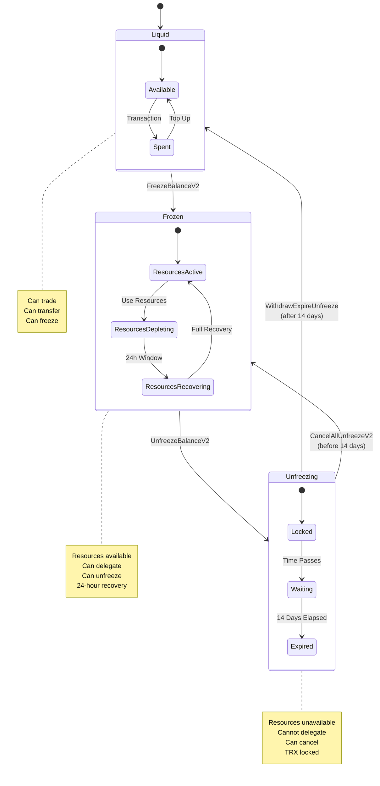

# Chapter 3: Freezing and Unfreezing Mechanics

> **Source**: Based on FreezeBalanceV2Actuator.java and UnfreezeBalanceV2Actuator.java analysis

## 3.1 Introduction to Freeze/Unfreeze Operations

The freeze/unfreeze system is the core mechanism for acquiring and releasing resources on TRON. This chapter provides a complete analysis of the V2 system introduced in Stake 2.0, including all contract types, state transitions, and implementation details.

## 3.2 FreezeBalanceV2 Operation

### 3.2.1 Contract Definition

**Protobuf Structure**: `protocol/src/main/protos/core/contract/balance_contract.proto` (Lines 84-88)

```protobuf
message FreezeBalanceV2Contract {
  bytes owner_address = 1;      // Account freezing TRX
  int64 frozen_balance = 2;      // Amount to freeze (in sun)
  ResourceCode resource = 3;     // BANDWIDTH, ENERGY, or TRON_POWER
}
```

**Contract Type**: 54 (FreezeBalanceV2Contract)

### 3.2.2 Validation Rules

**Source**: `actuator/src/main/java/org/tron/core/actuator/FreezeBalanceV2Actuator.java` (Lines 92-164)

```java
@Override
public boolean validate() throws ContractValidateException {
    // 1. Check feature is enabled
    if (!dynamicStore.supportUnfreezeDelay()) {
        throw new ContractValidateException("Not support FreezeV2 transaction");
    }

    // 2. Validate address
    if (!DecodeUtil.addressValid(ownerAddress)) {
        throw new ContractValidateException("Invalid address");
    }

    // 3. Account must exist
    AccountCapsule accountCapsule = accountStore.get(ownerAddress);
    if (accountCapsule == null) {
        throw new ContractValidateException("Account does not exist");
    }

    // 4. Validate freeze amount
    long frozenBalance = freezeBalanceV2Contract.getFrozenBalance();
    if (frozenBalance <= 0) {
        throw new ContractValidateException("frozenBalance must be positive");
    }
    if (frozenBalance < TRX_PRECISION) {  // TRX_PRECISION = 1,000,000
        throw new ContractValidateException("frozenBalance must be >= 1 TRX");
    }
    if (frozenBalance > accountCapsule.getBalance()) {
        throw new ContractValidateException("Insufficient balance");
    }

    // 5. Validate resource type
    switch (freezeBalanceV2Contract.getResource()) {
        case BANDWIDTH:
        case ENERGY:
            break;
        case TRON_POWER:
            if (!dynamicStore.supportAllowNewResourceModel()) {
                throw new ContractValidateException("TRON_POWER not supported");
            }
            break;
        default:
            throw new ContractValidateException("Invalid ResourceCode");
    }

    return true;
}
```

**Validation Requirements**:
1. Feature must be enabled (`supportUnfreezeDelay()`)
2. Valid address format (21 bytes)
3. Account must exist
4. Amount > 0 and >= 1 TRX (1,000,000 sun)
5. Sufficient balance
6. Valid resource type

### 3.2.3 Execution Process

**Source**: `actuator/src/main/java/org/tron/core/actuator/FreezeBalanceV2Actuator.java` (Lines 33-89)

```java
@Override
public boolean execute(Object result) throws ContractExeException {
    // 1. Parse contract
    FreezeBalanceV2Contract contract = any.unpack(FreezeBalanceV2Contract.class);
    AccountCapsule account = accountStore.get(contract.getOwnerAddress().toByteArray());
    long frozenBalance = contract.getFrozenBalance();

    // 2. Initialize old TRON Power if needed
    if (dynamicStore.supportAllowNewResourceModel()
        && account.oldTronPowerIsNotInitialized()) {
        account.initializeOldTronPower();
    }

    // 3. Deduct balance
    long newBalance = account.getBalance() - frozenBalance;
    account.setBalance(newBalance);

    // 4. Update resource-specific state
    switch (contract.getResource()) {
        case BANDWIDTH:
            long oldNetWeight = account.getFrozenV2BalanceWithDelegated(BANDWIDTH) / TRX_PRECISION;
            account.addFrozenBalanceForBandwidthV2(frozenBalance);
            long newNetWeight = account.getFrozenV2BalanceWithDelegated(BANDWIDTH) / TRX_PRECISION;
            dynamicStore.addTotalNetWeight(newNetWeight - oldNetWeight);
            break;

        case ENERGY:
            long oldEnergyWeight = account.getFrozenV2BalanceWithDelegated(ENERGY) / TRX_PRECISION;
            account.addFrozenBalanceForEnergyV2(frozenBalance);
            long newEnergyWeight = account.getFrozenV2BalanceWithDelegated(ENERGY) / TRX_PRECISION;
            dynamicStore.addTotalEnergyWeight(newEnergyWeight - oldEnergyWeight);
            break;

        case TRON_POWER:
            long oldTPWeight = account.getTronPowerFrozenV2Balance() / TRX_PRECISION;
            account.addFrozenForTronPowerV2(frozenBalance);
            long newTPWeight = account.getTronPowerFrozenV2Balance() / TRX_PRECISION;
            dynamicStore.addTotalTronPowerWeight(newTPWeight - oldTPWeight);
            break;
    }

    // 5. Persist account
    accountStore.put(account.createDbKey(), account);

    return true;
}
```

**Execution Steps**:
1. Parse contract parameters
2. Initialize legacy TRON Power tracking (if needed)
3. Deduct TRX from balance
4. Add to frozen balance (V2)
5. Update global network weight
6. Persist account state

**State Changes**:
- `account.balance` ← `balance - frozenBalance`
- `account.frozenV2[resource]` ← `frozenV2[resource] + frozenBalance`
- `network.totalWeight[resource]` ← `totalWeight + (frozenBalance / 1,000,000)`

### 3.2.4 Example Transaction

```javascript
// Freeze 10,000 TRX for ENERGY
const transaction = await tronWeb.transactionBuilder.freezeBalanceV2(
    10_000_000_000,  // 10,000 TRX in sun
    0,               // BANDWIDTH = 0, ENERGY = 1, TRON_POWER = 2
    ownerAddress
);

const signedTx = await tronWeb.trx.sign(transaction);
const result = await tronWeb.trx.sendRawTransaction(signedTx);
```

**Result**:
- Balance: 100,000 TRX → 90,000 TRX
- Frozen for Energy: 0 TRX → 10,000 TRX
- Energy Limit: 0 → ~180,000 energy (depends on network weight)
- Fee: 0 TRX (no fee for freeze operation)

## 3.3 UnfreezeBalanceV2 Operation

### 3.3.1 Contract Definition

**Protobuf Structure**: `protocol/src/main/protos/core/contract/balance_contract.proto` (Lines 90-94)

```protobuf
message UnfreezeBalanceV2Contract {
  bytes owner_address = 1;       // Account unfreezing TRX
  int64 unfreeze_balance = 2;    // Amount to unfreeze (in sun)
  ResourceCode resource = 3;      // Resource type to unfreeze
}
```

**Contract Type**: 55 (UnfreezeBalanceV2Contract)

### 3.3.2 Validation Rules

**Source**: `actuator/src/main/java/org/tron/core/actuator/UnfreezeBalanceV2Actuator.java` (Lines 104-185)

```java
public static final int UNFREEZE_MAX_TIMES = 32;  // Maximum concurrent unfreezes

@Override
public boolean validate() throws ContractValidateException {
    // 1. Check frozen balance exists
    switch (unfreezeBalanceV2Contract.getResource()) {
        case BANDWIDTH:
            if (!checkExistFrozenBalance(accountCapsule, BANDWIDTH)) {
                throw new ContractValidateException("no frozenBalance(BANDWIDTH)");
            }
            break;
        case ENERGY:
            if (!checkExistFrozenBalance(accountCapsule, ENERGY)) {
                throw new ContractValidateException("no frozenBalance(Energy)");
            }
            break;
        case TRON_POWER:
            if (!dynamicStore.supportAllowNewResourceModel()) {
                throw new ContractValidateException("TRON_POWER not supported");
            }
            if (!checkExistFrozenBalance(accountCapsule, TRON_POWER)) {
                throw new ContractValidateException("no frozenBalance(TronPower)");
            }
            break;
    }

    // 2. Validate unfreeze amount
    if (!checkUnfreezeBalance(accountCapsule, contract, resource)) {
        throw new ContractValidateException("Invalid unfreeze_balance");
    }

    // 3. Check unfreeze count limit
    int unfreezingCount = accountCapsule.getUnfreezingV2Count(now);
    if (UNFREEZE_MAX_TIMES <= unfreezingCount) {
        throw new ContractValidateException("Unfreezing times over limit (32)");
    }

    return true;
}
```

**Key Limits**:
- Maximum 32 concurrent unfreeze operations per account
- Must have sufficient frozen balance
- Cannot unfreeze more than frozen amount

### 3.3.3 Execution Process

**Source**: `actuator/src/main/java/org/tron/core/actuator/UnfreezeBalanceV2Actuator.java` (Lines 51-101)

```java
@Override
public boolean execute(Object result) throws ContractExeException {
    byte[] ownerAddress = unfreezeBalanceV2Contract.getOwnerAddress().toByteArray();
    long now = dynamicStore.getLatestBlockHeaderTimestamp();

    // 1. Withdraw any expired unfreezes first
    mortgageService.withdrawReward(ownerAddress);
    long unfreezeAmount = this.unfreezeExpire(accountCapsule, now);

    // 2. Get unfreeze parameters
    long unfreezeBalance = unfreezeBalanceV2Contract.getUnfreezeBalance();
    ResourceCode freezeType = unfreezeBalanceV2Contract.getResource();

    // 3. Calculate expire time (now + 14 days default)
    long expireTime = this.calcUnfreezeExpireTime(now);

    // 4. Add to unfrozen list
    accountCapsule.addUnfrozenV2List(freezeType, unfreezeBalance, expireTime);

    // 5. Update total resource weight
    this.updateTotalResourceWeight(accountCapsule, unfreezeBalanceV2Contract, unfreezeBalance);

    // 6. Update votes if TRON_POWER
    this.updateVote(accountCapsule, unfreezeBalanceV2Contract, ownerAddress);

    // 7. Persist account
    accountStore.put(ownerAddress, accountCapsule);

    return true;
}
```

**Execution Steps**:
1. Auto-withdraw any expired unfreezes
2. Extract unfreeze parameters
3. Calculate expiration (now + 14 days)
4. Create UnFreezeV2 record
5. Update global weight (reduce)
6. Update voting power (if TRON_POWER)
7. Persist state

**State Changes**:
- `account.frozenV2[resource]` ← `frozenV2[resource] - unfreezeBalance`
- `account.unfrozenV2[]` ← Add new UnFreezeV2 record
- `network.totalWeight[resource]` ← `totalWeight - (unfreezeBalance / 1,000,000)`
- Resource limits decrease immediately

### 3.3.4 14-Day Wait Period

**Calculation**:

```java
private long calcUnfreezeExpireTime(long now) {
    long unfreezeDelayDays = dynamicStore.getUnfreezeDelayDays();
    return now + unfreezeDelayDays * 86_400_000;  // Days to milliseconds
}
```

**Default**: 14 days (1,209,600,000 milliseconds)

**Configurable**: Via governance proposal (Parameter #61)

**Timeline**:
```
Day 0:  UnfreezeBalanceV2 → Resources unavailable, TRX locked
Day 1:  Still locked
...
Day 13: Still locked
Day 14: Can withdraw via WithdrawExpireUnfreeze
```

## 3.4 WithdrawExpireUnfreeze Operation

### 3.4.1 Contract Definition

**Protobuf**: `protocol/src/main/protos/core/contract/balance_contract.proto` (Lines 96-98)

```protobuf
message WithdrawExpireUnfreezeContract {
  bytes owner_address = 1;  // Only parameter
}
```

**Contract Type**: 56 (WithdrawExpireUnfreezeContract)

### 3.4.2 Purpose

Withdraws all expired unfreeze records and returns TRX to liquid balance.

**Trigger Conditions**:
- At least one UnFreezeV2 record with `unfreeze_time + 14 days <= current_time`
- Automatically triggered during UnfreezeBalanceV2 execution
- Can be manually called anytime

### 3.4.3 Execution Logic

```java
private long unfreezeExpire(AccountCapsule accountCapsule, long now) {
    List<UnFreezeV2> unfrozenV2List = accountCapsule.getUnfrozenV2List();
    long totalUnfrozen = 0;

    // Find all expired unfreezes
    List<UnFreezeV2> expiredList = unfrozenV2List.stream()
        .filter(uf -> uf.getUnfreezeTime() <= now)
        .collect(Collectors.toList());

    // Sum amounts
    for (UnFreezeV2 unfreeze : expiredList) {
        totalUnfrozen += unfreeze.getUnfrozenBalance();
    }

    // Return to balance
    if (totalUnfrozen > 0) {
        accountCapsule.setBalance(accountCapsule.getBalance() + totalUnfrozen);

        // Remove expired records
        accountCapsule.clearExpiredUnfrozenV2(now);
    }

    return totalUnfrozen;
}
```

**State Changes**:
- `account.balance` ← `balance + total_expired_amount`
- Remove all expired UnFreezeV2 records

### 3.4.4 Example Scenario

```
Time T0: Freeze 10,000 TRX for energy
Time T1 (1 day later): Unfreeze 10,000 TRX
  → Created UnFreezeV2 record with expire_time = T1 + 14 days
  → Energy limit immediately drops to 0
  → TRX still locked in unfrozen state

Time T2 (15 days after T1): WithdrawExpireUnfreeze
  → UnFreezeV2 record removed
  → Balance increases by 10,000 TRX
  → TRX now liquid and can be traded
```

## 3.5 CancelAllUnfreezeV2 Operation

### 3.5.1 Contract Definition

**Protobuf**: `protocol/src/main/protos/core/contract/balance_contract.proto` (Lines 116-118)

```protobuf
message CancelAllUnfreezeV2Contract {
  bytes owner_address = 1;  // Only parameter
}
```

**Contract Type**: 59 (CancelAllUnfreezeV2Contract)

### 3.5.2 Purpose

Cancels ALL pending unfreeze operations and immediately refreezes the TRX.

**Use Case**: User changed their mind before 14-day period expired

### 3.5.3 Execution Logic

```java
@Override
public boolean execute(Object result) {
    // Get all pending unfreezes
    List<UnFreezeV2> unfreezeList = account.getUnfrozenV2List();

    for (UnFreezeV2 unfreeze : unfreezeList) {
        long amount = unfreeze.getUnfrozenBalance();
        ResourceCode resource = unfreeze.getType();

        // Refreeze the amount
        FreezeV2 freeze = FreezeV2.newBuilder()
            .setAmount(amount)
            .setType(resource)
            .build();

        account.addFrozenV2List(freeze);

        // Restore global weight
        long weight = amount / TRX_PRECISION;
        dynamicStore.addTotalResourceWeight(resource, weight);

        // Restore resource limits
        account.updateResourceLimit(resource);
    }

    // Clear all unfreezes
    account.clearAllUnfrozenV2();

    accountStore.put(account.createDbKey(), account);

    return true;
}
```

**State Changes**:
- All UnFreezeV2 records → removed
- All amounts → refrozen (added back to frozenV2)
- Resource limits → restored immediately
- Global weights → increased

### 3.5.4 Example Scenario

```
Time T0: Unfreeze 10,000 TRX for energy
  → Energy limit: 180,000 → 0
  → UnFreezeV2 record created

Time T1 (2 days later): CancelAllUnfreezeV2
  → UnFreezeV2 record removed
  → FrozenV2 record created with 10,000 TRX
  → Energy limit: 0 → 180,000 (restored)
  → No 14-day wait needed
```

**Cost**: 10,000 energy (from EnergyCost.java line 45)

## 3.6 Complete State Transition Diagram



## 3.7 Edge Cases and Special Scenarios

### 3.7.1 Partial Unfreeze

**Scenario**: Freeze 100,000 TRX, unfreeze 30,000 TRX

```
Initial state:
- Frozen: 100,000 TRX
- Energy limit: 1,800,000

After UnfreezeBalanceV2(30,000 TRX):
- Frozen: 70,000 TRX
- Unfrozen: 30,000 TRX (14-day wait)
- Energy limit: 1,260,000 (30% reduction)

Can perform:
- Additional UnfreezeBalanceV2 for remaining 70,000 TRX
- CancelAllUnfreezeV2 to refreeze the 30,000 TRX
- Wait 14 days and WithdrawExpireUnfreeze
```

### 3.7.2 Multiple Unfreeze Operations

**Scenario**: Multiple unfreezes before any withdrawal

```
Day 0:  Freeze 100,000 TRX
Day 1:  Unfreeze 20,000 TRX → Record 1 (expires Day 15)
Day 3:  Unfreeze 30,000 TRX → Record 2 (expires Day 17)
Day 7:  Unfreeze 50,000 TRX → Record 3 (expires Day 21)

Day 15: WithdrawExpireUnfreeze → Withdraw 20,000 TRX (Record 1)
Day 17: WithdrawExpireUnfreeze → Withdraw 30,000 TRX (Record 2)
Day 21: WithdrawExpireUnfreeze → Withdraw 50,000 TRX (Record 3)

Alternative:
Day 10: CancelAllUnfreezeV2 → Refreeze all 100,000 TRX
```

**Maximum**: 32 concurrent unfreeze records (UNFREEZE_MAX_TIMES)

### 3.7.3 Delegation During Unfreezing

**Restriction**: Cannot delegate resources that are in unfreezing state

```
Frozen: 100,000 TRX → Energy limit: 1,800,000

Scenario 1 (Valid):
- Delegate 50,000 TRX worth of energy → OK
- Remaining own energy: 900,000

Scenario 2 (Invalid):
- Unfreeze 50,000 TRX → Energy limit: 900,000
- Try to delegate 50,000 TRX → FAIL
  Reason: Unfrozen TRX is locked, not available for delegation
```

### 3.7.4 Resource Recovery During Unfreeze

**Key Behavior**: Resource limits decrease immediately, recovery window adjusts

```
Before Unfreeze:
- Frozen: 100,000 TRX
- Energy limit: 1,800,000
- Energy used: 900,000 (50% used)
- Recovery window: 28,800 blocks

After UnfreezeBalanceV2(50,000 TRX):
- Frozen: 50,000 TRX
- Energy limit: 900,000 (50% reduction)
- Energy used: 900,000 (100% used - limit equals usage!)
- Recovery window: Recalculated proportionally

Result: No energy available until recovery progresses
```

## 3.8 Gas Costs

| Operation | Energy | Bandwidth | TRX Cost (no resources) |
|-----------|--------|-----------|------------------------|
| FreezeBalanceV2 | 10,000 | ~270 bytes | ~4.20 TRX |
| UnfreezeBalanceV2 | 10,000 | ~270 bytes | ~4.20 TRX |
| WithdrawExpireUnfreeze | 10,000 | ~270 bytes | ~4.20 TRX |
| CancelAllUnfreezeV2 | 10,000 | ~270 bytes | ~4.20 TRX |

**Source**: `actuator/src/main/java/org/tron/core/vm/EnergyCost.java` (Lines 42-45)

## 3.9 Summary and Best Practices

### Key Takeaways

1. **Freeze V2 is Flexible**: No mandatory lock period, partial operations supported
2. **14-Day Unfreeze Delay**: Cannot immediately access unfrozen TRX
3. **Cancellation Available**: CancelAllUnfreezeV2 reverses unfreeze before expiration
4. **Immediate Resource Changes**: Limits update instantly on freeze/unfreeze
5. **32 Operation Limit**: Maximum 32 concurrent unfreeze operations

### Best Practices

1. **Plan Unfreezes**: Consider 14-day lockup when timing unfreezes
2. **Partial Operations**: Use partial unfreezes to maintain some resources
3. **Monitor Expiration**: Track unfreeze expiration times
4. **Batch Withdrawals**: Withdraw multiple expired unfreezes in one transaction
5. **Cancel if Needed**: Use CancelAllUnfreezeV2 if circumstances change
6. **Check Limits**: Verify resource limits before major operations

### Common Pitfalls

❌ **Unfreeze too much**: Energy drops to zero, must burn TRX
❌ **Forget 14-day wait**: Plan ahead for liquidity needs
❌ **Exceed 32 limit**: Cannot unfreeze if 32 pending operations
❌ **Unfreeze delegated resources**: Must undelegate first

---

**Next Chapter**: Chapter 4 will explore the resource delegation system in depth, covering delegation contracts, lock periods, proportional consumption, and undelegation mechanics.

**References**:
- java-tron source: `actuator/src/main/java/org/tron/core/actuator/FreezeBalanceV2Actuator.java`
- java-tron source: `actuator/src/main/java/org/tron/core/actuator/UnfreezeBalanceV2Actuator.java`
- java-tron source: `protocol/src/main/protos/core/contract/balance_contract.proto`
- TIP-467: Stake 2.0 Specification
