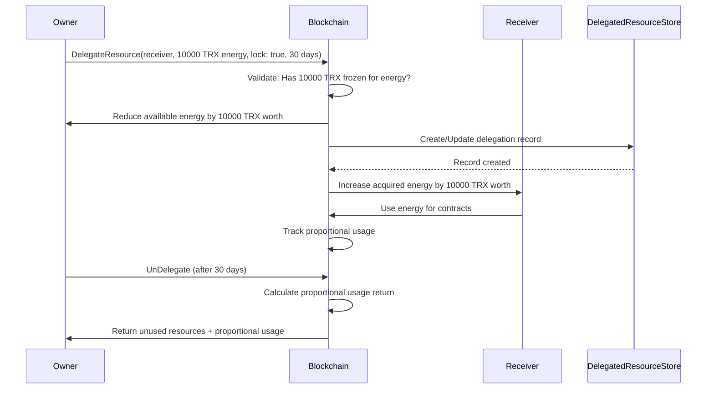

# Chapter 4: Resource Delegation System

> **Source**: Based on DelegateResourceActuator.java and UnDelegateResourceActuator.java analysis

## 4.1 Introduction to Resource Delegation

Resource delegation allows users to share their frozen resources with other accounts while retaining ownership of the underlying TRX. This enables resource markets, dApp sponsorship models, and flexible resource allocation strategies.

## 4.2 DelegateResource Operation

### 4.2.1 Contract Definition

**Protobuf**: `protocol/src/main/protos/core/contract/balance_contract.proto` (Lines 100-107)

```protobuf
message DelegateResourceContract {
  bytes owner_address = 1;         // Address delegating resources
  ResourceCode resource = 2;       // BANDWIDTH or ENERGY
  int64 balance = 3;               // Amount to delegate (in sun of resource)
  bytes receiver_address = 4;      // Address receiving resources
  bool lock = 5;                   // Apply lock period?
  int64 lock_period = 6;           // Optional: lock duration (seconds)
}
```

**Contract Type**: 57 (DelegateResourceContract)

**Key Features**:
- Owner retains TRX ownership
- Receiver gains resource usage rights
- Optional lock period (prevents early undelegation)
- Supports BANDWIDTH and ENERGY (NOT TRON_POWER)

### 4.2.2 Delegation Process



### 4.2.3 Execution Logic

**Source**: `actuator/src/main/java/org/tron/core/actuator/DelegateResourceActuator.java`

```java
@Override
public boolean execute(Object result) {
    // 1. Extract parameters
    byte[] ownerAddress = contract.getOwnerAddress().toByteArray();
    byte[] receiverAddress = contract.getReceiverAddress().toByteArray();
    long balance = contract.getBalance();
    ResourceCode resource = contract.getResource();
    boolean lock = contract.getLock();
    long lockPeriod = contract.getLockPeriod();

    // 2. Calculate lock expiration
    long expireTime;
    if (lock && lockPeriod > 0) {
        expireTime = now + lockPeriod;
    } else if (lock) {
        expireTime = now + dynamicStore.getDefaultDelegateLockPeriod();  // 3 days default
    } else {
        expireTime = 0;  // No lock
    }

    // 3. Get or create delegation record
    byte[] key = createDelegationKey(ownerAddress, receiverAddress);
    DelegatedResourceCapsule delegation = delegatedResourceStore.get(key);

    if (delegation == null) {
        delegation = new DelegatedResourceCapsule(
            ByteString.copyFrom(ownerAddress),
            ByteString.copyFrom(receiverAddress)
        );
    }

    // 4. Update delegation amounts
    if (resource == BANDWIDTH) {
        long oldAmount = delegation.getFrozenBalanceForBandwidth();
        delegation.setFrozenBalanceForBandwidth(oldAmount + balance);
        delegation.setExpireTimeForBandwidth(expireTime);
    } else if (resource == ENERGY) {
        long oldAmount = delegation.getFrozenBalanceForEnergy();
        delegation.setFrozenBalanceForEnergy(oldAmount + balance);
        delegation.setExpireTimeForEnergy(expireTime);
    }

    // 5. Persist delegation
    delegatedResourceStore.put(key, delegation);

    // 6. Update owner account
    AccountCapsule owner = accountStore.get(ownerAddress);
    if (resource == BANDWIDTH) {
        owner.addDelegatedFrozenBalanceForBandwidth(balance);
    } else {
        owner.addDelegatedFrozenBalanceForEnergy(balance);
    }

    // 7. Update receiver account
    AccountCapsule receiver = accountStore.get(receiverAddress);
    if (resource == BANDWIDTH) {
        receiver.addAcquiredDelegatedFrozenBalanceForBandwidth(balance);
    } else {
        receiver.addAcquiredDelegatedFrozenBalanceForEnergy(balance);
    }

    // 8. Update index
    updateDelegatedResourceAccountIndex(ownerAddress, receiverAddress);

    // 9. Persist accounts
    accountStore.put(ownerAddress, owner);
    accountStore.put(receiverAddress, receiver);

    return true;
}
```

**State Changes**:
1. **DelegatedResourceStore**: New or updated delegation record
2. **Owner Account**:
   - `delegated_frozen_balance[resource]` += balance
   - Available resource limit decreases
3. **Receiver Account**:
   - `acquired_delegated_frozen_balance[resource]` += balance
   - Total resource limit increases
4. **DelegatedResourceAccountIndex**: Updated for receiver lookups

### 4.2.4 Lock Period Mechanics

**Lock Types**:

1. **No Lock** (`lock = false`):
   ```java
   expireTime = 0;  // Can undelegate immediately
   ```

2. **Default Lock** (`lock = true`, `lock_period = 0`):
   ```java
   expireTime = now + 3 days (default);
   ```

3. **Custom Lock** (`lock = true`, `lock_period = specified`):
   ```java
   expireTime = now + lock_period;
   // Maximum: Configurable by governance (typically 90 days)
   ```

**Lock Enforcement**:
- Owner CANNOT undelegate before `expireTime`
- Receiver can use resources immediately
- Lock applies per delegation (can have multiple with different times)

### 4.2.5 Resource Limit Calculations

**Owner's New Limit**:
```
owner_limit = (owner_frozen / 1,000,000) × (total_limit / total_weight)
              - owner_delegated_out

Example:
- Owner frozen: 100,000 TRX for energy
- Network state: 10B total weight, 180B energy limit
- Owner limit before delegation: 1,800,000 energy

After delegating 50,000 TRX worth:
- Owner limit: 1,800,000 - 900,000 = 900,000 energy
```

**Receiver's New Limit**:
```
receiver_limit = (receiver_frozen / 1,000,000) × (total_limit / total_weight)
                 + receiver_acquired_delegated

Example:
- Receiver frozen: 0 TRX
- Receiver limit before delegation: 0 energy

After receiving 50,000 TRX worth delegation:
- Receiver limit: 0 + 900,000 = 900,000 energy
```

## 4.3 Proportional Consumption Model

### 4.3.1 Mixed Resource Usage

When receiver has both own resources and delegated resources, consumption is proportional:

```
total_receiver_resources = own_resources + delegated_resources
usage_ratio = consumed / total_receiver_resources

own_consumption = own_resources × usage_ratio
delegated_consumption = delegated_resources × usage_ratio
```

**Example**:

```
Receiver has:
- Own frozen: 50,000 TRX → 900,000 energy
- Delegated: 50,000 TRX → 900,000 energy
- Total: 1,800,000 energy

Receiver uses: 600,000 energy

usage_ratio = 600,000 / 1,800,000 = 1/3

own_consumption = 900,000 × 1/3 = 300,000 energy
delegated_consumption = 900,000 × 1/3 = 300,000 energy

Receiver remaining:
- Own: 900,000 - 300,000 = 600,000 energy
- Delegated: 900,000 - 300,000 = 600,000 energy
- Total: 1,200,000 energy
```

### 4.3.2 Multiple Delegators

Receiver can receive delegations from multiple owners:

```
Receiver has:
- Own: 30,000 TRX → 540,000 energy
- From Owner A: 40,000 TRX → 720,000 energy
- From Owner B: 30,000 TRX → 540,000 energy
- Total: 1,800,000 energy

Receiver uses: 900,000 energy

Consumption distribution:
- Own: 540,000 / 1,800,000 × 900,000 = 270,000
- From A: 720,000 / 1,800,000 × 900,000 = 360,000
- From B: 540,000 / 1,800,000 × 900,000 = 270,000
```

## 4.4 UnDelegateResource Operation

### 4.4.1 Contract Definition

**Protobuf**: `protocol/src/main/protos/core/contract/balance_contract.proto` (Lines 109-114)

```protobuf
message UnDelegateResourceContract {
  bytes owner_address = 1;        // Address undelegating
  ResourceCode resource = 2;      // BANDWIDTH or ENERGY
  int64 balance = 3;              // Amount to undelegate (in sun)
  bytes receiver_address = 4;     // Address losing resources
}
```

**Contract Type**: 58 (UnDelegateResourceContract)

### 4.4.2 Validation Rules

```java
@Override
public boolean validate() {
    // 1. Delegation record must exist
    DelegatedResourceCapsule delegation = delegatedResourceStore.get(key);
    if (delegation == null) {
        throw new ContractValidateException("No delegation found");
    }

    // 2. Check sufficient delegated amount
    if (resource == BANDWIDTH) {
        if (delegation.getFrozenBalanceForBandwidth() < balance) {
            throw new ContractValidateException("Insufficient delegated bandwidth");
        }
        // 3. Check lock period
        if (delegation.getExpireTimeForBandwidth() > now) {
            throw new ContractValidateException("Lock period not expired");
        }
    } else if (resource == ENERGY) {
        if (delegation.getFrozenBalanceForEnergy() < balance) {
            throw new ContractValidateException("Insufficient delegated energy");
        }
        if (delegation.getExpireTimeForEnergy() > now) {
            throw new ContractValidateException("Lock period not expired");
        }
    }

    return true;
}
```

**Requirements**:
1. Delegation record exists
2. Sufficient delegated amount
3. Lock period expired (if lock was applied)

### 4.4.3 Execution Logic with Usage Return

**Source**: `chainbase/src/main/java/org/tron/core/db/ResourceProcessor.java` (Lines 141-203)

```java
public void unDelegateIncrease(AccountCapsule owner, AccountCapsule receiver,
    long transferUsage, ResourceCode resourceCode, long now) {

    // 1. Update owner's own usage first (with recovery)
    long ownerUsage = owner.getUsage(resourceCode);
    long lastOwnerTime = owner.getLastConsumeTime(resourceCode);
    ownerUsage = increase(owner, resourceCode, ownerUsage, 0, lastOwnerTime, now);

    // 2. Calculate new owner usage including transferred usage
    long newOwnerUsage = ownerUsage + transferUsage;

    if (newOwnerUsage == 0) {
        // No usage to transfer
        owner.setNewWindowSize(resourceCode, this.windowSize);
        owner.setUsage(resourceCode, 0);
        owner.setLatestTime(resourceCode, now);
        return;
    }

    // 3. Get window sizes
    long remainOwnerWindowSize = owner.getWindowSize(resourceCode);
    long remainReceiverWindowSize = receiver.getWindowSize(resourceCode);

    // 4. Calculate combined window size (weighted average)
    long newOwnerWindowSize = getNewWindowSize(
        ownerUsage,                  // Owner's current usage
        remainOwnerWindowSize,       // Owner's window
        transferUsage,               // Usage from receiver
        remainReceiverWindowSize,    // Receiver's window
        newOwnerUsage                // Total new usage
    );

    // 5. Update owner state
    owner.setNewWindowSize(resourceCode, newOwnerWindowSize);
    owner.setUsage(resourceCode, newOwnerUsage);
    owner.setLatestTime(resourceCode, now);
}

private long getNewWindowSize(long lastUsage, long lastWindowSize,
    long usage, long windowSize, long newUsage) {
    return (lastUsage * lastWindowSize + usage * windowSize) / newUsage;
}
```

**Usage Transfer Calculation**:

```
receiver_total_resources = receiver_own + all_delegations
receiver_usage = receiver_current_usage

proportion_from_this_delegation = undelegated_amount / receiver_total_resources
usage_to_transfer = receiver_usage × proportion_from_this_delegation
```

**Example**:

```
Receiver has:
- Own: 50,000 TRX → 900,000 energy
- Delegated from Owner: 50,000 TRX → 900,000 energy
- Total: 1,800,000 energy
- Current usage: 600,000 energy

Owner undelegates 50,000 TRX (entire delegation):

proportion = 900,000 / 1,800,000 = 0.5
usage_to_transfer = 600,000 × 0.5 = 300,000 energy

After undelegation:
Owner receives back:
- Resource limit: +900,000 energy
- Usage: +300,000 energy (inherited from receiver)
- Net available: 600,000 energy

Receiver loses:
- Resource limit: -900,000 energy
- Usage: remains 600,000 (but proportionally scaled)
- Net available: reduced by 600,000
```

### 4.4.4 Complete State Transitions

```
Before UnDelegate:
Owner:
  frozen: 100,000 TRX (energy)
  delegated_out: 50,000 TRX
  own_limit: 900,000 energy
  own_usage: 200,000 energy

Receiver:
  frozen: 50,000 TRX (energy)
  acquired_delegated: 50,000 TRX
  total_limit: 1,800,000 energy
  total_usage: 600,000 energy

After UnDelegate (50,000 TRX):
Owner:
  frozen: 100,000 TRX (unchanged)
  delegated_out: 0 TRX
  own_limit: 1,800,000 energy
  own_usage: 200,000 + 300,000 = 500,000 energy

Receiver:
  frozen: 50,000 TRX (unchanged)
  acquired_delegated: 0 TRX
  total_limit: 900,000 energy
  total_usage: 300,000 energy
```

## 4.5 Delegation Storage

### 4.5.1 DelegatedResourceStore

**Key Structure**:
```
Key: owner_address (21 bytes) + receiver_address (21 bytes) = 42 bytes
Value: DelegatedResourceCapsule
```

**Data Fields**:
```java
class DelegatedResourceCapsule {
    ByteString from;                          // Owner address
    ByteString to;                            // Receiver address
    long frozenBalanceForBandwidth;           // Delegated bandwidth amount
    long frozenBalanceForEnergy;              // Delegated energy amount
    long expireTimeForBandwidth;              // Bandwidth lock expiration
    long expireTimeForEnergy;                 // Energy lock expiration
}
```

### 4.5.2 DelegatedResourceAccountIndex

**Purpose**: Reverse lookup (find all delegators for a receiver)

**Key Structure**:
```
Key: receiver_address (21 bytes)
Value: List of owner addresses
```

**Use Case**: Query "Who has delegated resources to account X?"

```java
List<byte[]> getDelegators(byte[] receiverAddress) {
    DelegatedResourceAccountIndexCapsule index =
        delegatedResourceAccountIndexStore.get(receiverAddress);
    return index.getFromAddressList();
}
```

## 4.6 Delegation Economics

### 4.6.1 Resource Market Model

Delegation enables resource rental markets:

```
Owner (Resource Provider):
- Has excess frozen TRX
- Delegates to users who need resources
- Can charge rent (off-chain agreement)
- Retains TRX ownership

Receiver (Resource Consumer):
- Needs resources but doesn't want to freeze TRX
- Pays rent to owner
- Uses resources for dApp operations
- Returns when done (or lock expires)
```

### 4.6.2 dApp Sponsorship Model

dApps can sponsor users by delegating resources:

```
dApp Account:
- Freezes large amount of TRX (e.g., 10,000,000 TRX)
- Gains 180,000,000 energy
- Delegates 10,000 energy to each new user
- Supports 18,000 concurrent users
- Users can use dApp without owning TRX
```

**Cost Analysis**:
```
Option A: Users burn TRX
- 14,000 energy per TRC-20 transfer
- 14,000 × 420 sun = 5,880,000 sun = 5.88 TRX per user
- 1,000 users × 5.88 TRX = 5,880 TRX burned

Option B: dApp delegates resources
- Freeze 1,000,000 TRX → 1,800,000 energy
- Support 128 users (14,000 each) per cycle
- TRX recoverable after dApp shuts down
- Effective cost: opportunity cost of locked TRX
```

### 4.6.3 Lock Period Strategies

**No Lock** (expireTime = 0):
- Maximum flexibility
- Owner can undelegate anytime
- Best for: trusted relationships, short-term needs

**Short Lock** (3 days):
- Balanced flexibility
- Receiver has guaranteed access
- Best for: temporary sponsorship, trials

**Long Lock** (30-90 days):
- Strong commitment
- Enables long-term planning
- Best for: resource rentals, stable dApps

## 4.7 Advanced Delegation Patterns

### 4.7.1 Cascading Delegation

**Question**: Can receiver re-delegate received resources?

**Answer**: NO. Only owner of frozen TRX can delegate.

```
Owner (100,000 TRX frozen) → Delegates 50,000 to User A
User A CANNOT delegate to User B

User A can only use resources, not re-delegate them.
```

### 4.7.2 Partial Undelegation

**Scenario**: Owner delegated 100,000 TRX, wants to reclaim 30,000 TRX

```
Initial:
- Delegation: 100,000 TRX (1,800,000 energy)
- Receiver usage: 600,000 energy

UnDelegate(30,000 TRX):
- Amount undelegated: 30,000 TRX (540,000 energy)
- Remaining delegation: 70,000 TRX (1,260,000 energy)
- Usage transferred: 600,000 × (540,000 / 1,800,000) = 180,000 energy

Result:
- Owner gains: 540,000 limit, 180,000 usage
- Receiver loses: 540,000 limit, usage scaled down
```

### 4.7.3 Multiple Receivers

**Scenario**: Owner delegates to multiple receivers

```
Owner: 1,000,000 TRX frozen (18,000,000 energy)

Delegations:
- Receiver A: 300,000 TRX (5,400,000 energy), 7-day lock
- Receiver B: 400,000 TRX (7,200,000 energy), no lock
- Receiver C: 300,000 TRX (5,400,000 energy), 30-day lock

Owner's remaining: 0 energy (all delegated out)

Management:
- Track each delegation separately
- Different lock periods
- Undelegate individually as locks expire
```

## 4.8 Edge Cases and Gotchas

### 4.8.1 Delegation Before Unfreeze

**Rule**: Cannot delegate resources that are in unfreezing state

```
Owner:
- Frozen: 100,000 TRX
- Unfreezing: 50,000 TRX (14-day wait)
- Available for delegation: Only resources from 50,000 TRX

Attempt to delegate 100,000 TRX worth: FAIL
Must wait for unfreezing to complete or cancel it.
```

### 4.8.2 Lock Period Edge Cases

**Scenario**: Delegation with lock, owner unfreezes frozen balance

```
Day 0: Owner freezes 100,000 TRX
Day 1: Owner delegates 100,000 TRX to Receiver (30-day lock)
Day 5: Owner tries to unfreeze 100,000 TRX → FAIL

Reason: Cannot unfreeze delegated resources until:
1. Undelegation completed, AND
2. Lock period expired
```

**Workaround**: Must wait 30 days, undelegate, THEN unfreeze

### 4.8.3 Receiver Overdraft

**Question**: What if receiver uses more resources than delegated?

**Answer**: Proportional consumption prevents this

```
Receiver has:
- Delegated: 900,000 energy (from Owner)
- Own: 0

Maximum usage: 900,000 energy

If receiver tries to use 1,000,000 energy:
- Transaction fails with "Insufficient energy"
- Owner's delegation is protected
```

## 4.9 Gas Costs

| Operation | Energy | Bandwidth | TRX Cost (no resources) |
|-----------|--------|-----------|------------------------|
| DelegateResource | 10,000 | ~320 bytes | ~4.20 TRX |
| UnDelegateResource | 10,000 | ~320 bytes | ~4.20 TRX |

**Source**: `actuator/src/main/java/org/tron/core/vm/EnergyCost.java` (Lines 46-47)

## 4.10 Summary and Best Practices

### Key Takeaways

1. **Owner Retains TRX**: Delegation transfers usage rights, not ownership
2. **Lock Periods Optional**: Can delegate with or without locks
3. **Proportional Consumption**: Usage distributed across all resources
4. **Usage Returns on Undelegate**: Owner inherits receiver's consumption
5. **No Re-delegation**: Only frozen TRX owners can delegate

### Best Practices

1. **Use Locks for Rentals**: Protect long-term delegations with locks
2. **Track Expiration Times**: Monitor when locks expire
3. **Monitor Receiver Usage**: Check how much receiver consumes
4. **Partial Operations**: Undelegate incrementally if needed
5. **Plan Unfreeze**: Cannot unfreeze delegated resources

### Common Pitfalls

❌ **Delegate while unfreezing**: Must complete unfreeze first
❌ **Unfreeze delegated TRX**: Must undelegate first
❌ **Expect instant undelegate**: Lock period must expire
❌ **Assume no usage cost**: Owner inherits receiver's usage

---

**Next Chapter**: Chapter 5 will explore transaction resource consumption patterns, including bandwidth calculation, energy costs for different operations, and fee structures.

**References**:
- java-tron source: `actuator/src/main/java/org/tron/core/actuator/DelegateResourceActuator.java`
- java-tron source: `actuator/src/main/java/org/tron/core/actuator/UnDelegateResourceActuator.java`
- java-tron source: `chainbase/src/main/java/org/tron/core/db/ResourceProcessor.java` (Lines 141-203)
- java-tron source: `protocol/src/main/protos/core/contract/balance_contract.proto`
