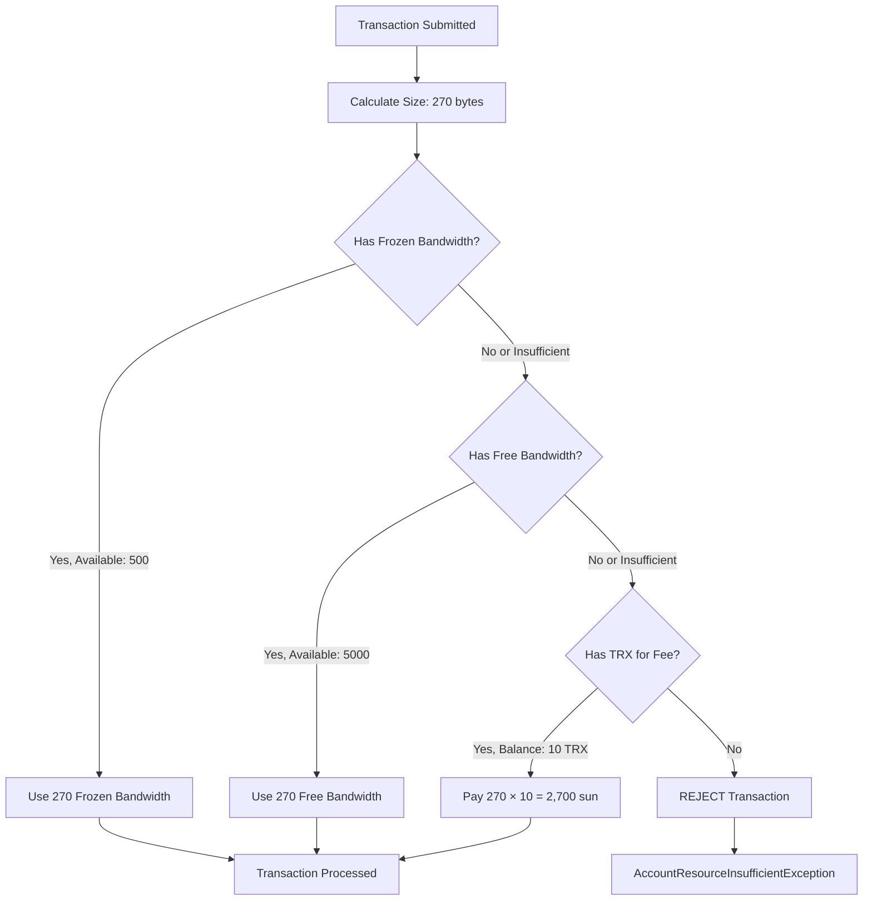

# Chapter 5: Transaction Resource Consumption

> **Source**: Based on BandwidthProcessor.java, EnergyProcessor.java, and EnergyCost.java analysis

## 5.1 Bandwidth Consumption

### 5.1.1 Bandwidth Calculation Model

Every transaction on TRON consumes bandwidth based on its serialized size:

```
bandwidth_cost = transaction_size_in_bytes × 1
```

**Source**: `chainbase/src/main/java/org/tron/core/db/BandwidthProcessor.java` (Lines 96-100)

### 5.1.2 Transaction Size Calculation

Transaction size includes:

```
total_size = raw_data_size + signature_size + (optional_fields_size)

Components:
- raw_data: Transaction data (contract parameters, addresses, amounts)
- signature: 65 bytes per signature
- optional fields: Permission IDs, expiration, ref_block_hash, etc.
```

**Typical Sizes**:

| Transaction Type | Approximate Size | Bandwidth Cost |
|------------------|------------------|----------------|
| TRX Transfer | 270 bytes | 270 bandwidth |
| TRC-20 Transfer | 340 bytes | 340 bandwidth |
| TRC-10 Transfer | 280 bytes | 280 bandwidth |
| Freeze V2 | 270 bytes | 270 bandwidth |
| Delegate Resource | 320 bytes | 320 bandwidth |
| Contract Creation | 2,000+ bytes | 2,000+ bandwidth |
| Vote Witness | 300+ bytes | 300+ bandwidth |

### 5.1.3 Consumption Priority Order

**Source**: `chainbase/src/main/java/org/tron/core/db/BandwidthProcessor.java` (Lines 96-100)

```java
@Override
public void consume(TransactionCapsule trx, TransactionTrace trace) {
    long bytes = trx.getSerializedSize();
    AccountCapsule account = getAccount(trx.getOwnerAddress());

    // Priority 1: Try account's frozen bandwidth
    if (useAccountNet(account, bytes, now)) {
        return;  // Success - used frozen bandwidth
    }

    // Priority 2: Try free daily bandwidth (5,000 bytes)
    if (useFreeNet(account, bytes, now)) {
        return;  // Success - used free bandwidth
    }

    // Priority 3: Fallback to transaction fee
    if (useTransactionFee(account, bytes, trace)) {
        return;  // Success - paid fee
    }

    // All failed - reject transaction
    throw new AccountResourceInsufficientException(
        "Insufficient bandwidth and balance"
    );
}
```

**Detailed Flow**:



### 5.1.4 Free Bandwidth Details

**Allocation**: 5,000 bytes per account per 24 hours

**Recovery**: Linear over 24-hour window (same as frozen bandwidth)

**Usage Tracking**:

```java
// Separate tracking from frozen bandwidth
long freeNetUsage = account.getFreeNetUsage();
long latestConsumeFreeTime = account.getLatestConsumeFreeTime();

// Apply recovery
long currentFreeUsage = increase(freeNetUsage, 0, latestConsumeFreeTime, now);

// Check availability
if (currentFreeUsage + bytes <= 5000) {
    // Use free bandwidth
    account.setFreeNetUsage(currentFreeUsage + bytes);
    account.setLatestConsumeFreeTime(now);
    return true;
}
```

**Example Timeline**:

```
Time 0:  Use 2,000 free bandwidth → 3,000 remaining
Time 6h: Recovered 500 → 3,500 remaining
Time 12h: Recovered 1,000 → 4,000 remaining
Time 18h: Use 1,500 → 2,500 remaining
Time 24h: Fully recovered → 5,000 available
```

### 5.1.5 Transaction Fee Calculation

**Formula**:

```
fee = bytes × transaction_fee_rate

Default: transaction_fee_rate = 10 sun/byte
```

**Source**: `chainbase/src/main/java/org/tron/core/db/ResourceProcessor.java` (Lines 222-241)

```java
protected boolean consumeFeeForBandwidth(AccountCapsule accountCapsule, long fee) {
    try {
        // Deduct from balance
        accountCapsule.setBalance(accountCapsule.getBalance() - fee);

        // Burn or add to fee pool
        if (dynamicPropertiesStore.supportTransactionFeePool()) {
            dynamicPropertiesStore.addTransactionFeePool(fee);
        } else if (dynamicPropertiesStore.supportBlackHoleOptimization()) {
            dynamicPropertiesStore.burnTrx(fee);
        } else {
            // Send to black hole address
            accountStore.getBlackhole().setBalance(
                accountStore.getBlackhole().getBalance() + fee
            );
        }

        return true;
    } catch (BalanceInsufficientException e) {
        return false;
    }
}
```

**Fee Examples**:

```
TRX Transfer (270 bytes):
fee = 270 × 10 = 2,700 sun = 0.0027 TRX

TRC-20 Transfer (340 bytes):
fee = 340 × 10 = 3,400 sun = 0.0034 TRX

Contract Creation (2,000 bytes):
fee = 2,000 × 10 = 20,000 sun = 0.02 TRX
```

## 5.2 Energy Consumption

### 5.2.1 TVM Operation Costs

Energy is consumed during smart contract execution. Each TVM opcode has a fixed cost.

**Source**: `actuator/src/main/java/org/tron/core/vm/EnergyCost.java` (Lines 13-62)

**Energy Tiers**:

```java
private static final long ZERO_TIER = 0;        // Free operations
private static final long BASE_TIER = 2;        // Basic arithmetic
private static final long VERY_LOW_TIER = 3;    // Bitwise operations
private static final long LOW_TIER = 5;         // Comparison operations
private static final long MID_TIER = 8;         // Memory operations
private static final long HIGH_TIER = 10;       // Complex operations
private static final long EXT_TIER = 20;        // External access
```

**Complete Cost Table**:

| Operation Category | Cost | Examples |
|-------------------|------|----------|
| **Arithmetic** | 2-10 | ADD, SUB, MUL, DIV, MOD |
| **Bitwise** | 3 | AND, OR, XOR, NOT, BYTE |
| **Comparison** | 3-5 | LT, GT, EQ, ISZERO |
| **Memory** | 3-8 | MLOAD, MSTORE, MSTORE8 |
| **Storage Read** | 50 | SLOAD |
| **Storage Write (new)** | 20,000 | SSTORE (new slot) |
| **Storage Write (update)** | 5,000 | SSTORE (existing) |
| **Call Operations** | 40+ | CALL, CALLCODE, DELEGATECALL |
| **Contract Creation** | 32,000 | CREATE, CREATE2 |
| **Log Operations** | 375+ | LOG0, LOG1, LOG2, LOG3, LOG4 |
| **SHA3** | 30+ | KECCAK256 |

**Special Operations**:

```java
// Native resource operations
private static final long FREEZE_V2 = 10000;
private static final long UNFREEZE_V2 = 10000;
private static final long DELEGATE_RESOURCE = 10000;
private static final long UN_DELEGATE_RESOURCE = 10000;
private static final long VOTE_WITNESS = 30000;
private static final long WITHDRAW_REWARD = 20000;
private static final long WITHDRAW_EXPIRE_UNFREEZE = 10000;
private static final long CANCEL_ALL_UNFREEZE_V2 = 10000;
```

### 5.2.2 Contract Execution Examples

#### Example 1: TRC-20 Transfer (Existing Account)

```solidity
function transfer(address recipient, uint256 amount) public returns (bool) {
    _balances[msg.sender] -= amount;      // SSTORE: 5,000
    _balances[recipient] += amount;        // SSTORE: 5,000
    emit Transfer(msg.sender, recipient, amount);  // LOG3: ~1,500
    return true;                           // RETURN: 0
}
```

**Total Energy**: ~14,000 energy

**Breakdown**:
- 2× SSTORE (update existing): 10,000
- 1× LOG3 event: ~1,500
- Misc operations (MLOAD, ADD, SUB): ~2,500
- **Total**: ~14,000 energy

#### Example 2: TRC-20 Transfer (New Account)

```solidity
function transfer(address recipient, uint256 amount) public returns (bool) {
    _balances[msg.sender] -= amount;      // SSTORE: 5,000
    _balances[recipient] += amount;        // SSTORE: 20,000 (NEW slot)
    emit Transfer(msg.sender, recipient, amount);  // LOG3: ~1,500
    return true;
}
```

**Total Energy**: ~64,000 energy

**Breakdown**:
- 1× SSTORE (update existing): 5,000
- 1× SSTORE (new slot): 20,000
- 1× NEW_ACCT_CALL: 25,000
- 1× LOG3 event: ~1,500
- Misc operations: ~12,500
- **Total**: ~64,000 energy

#### Example 3: Complex DeFi Swap

```solidity
function swap(uint256 amountIn) public {
    // Multiple storage reads
    uint256 reserve0 = _reserves[0];      // SLOAD: 50
    uint256 reserve1 = _reserves[1];      // SLOAD: 50

    // Calculations
    uint256 amountOut = getAmountOut(amountIn, reserve0, reserve1);  // ~500

    // Token transfers (external calls)
    token0.transferFrom(msg.sender, address(this), amountIn);  // CALL: ~15,000
    token1.transfer(msg.sender, amountOut);                    // CALL: ~15,000

    // Update reserves
    _reserves[0] += amountIn;             // SSTORE: 5,000
    _reserves[1] -= amountOut;            // SSTORE: 5,000

    // Emit events
    emit Swap(msg.sender, amountIn, amountOut);  // LOG3: ~1,500
}
```

**Total Energy**: ~42,000+ energy

### 5.2.3 Memory Expansion Costs

Memory usage in contracts has quadratic cost:

```
memory_cost = 3 × words + (words^2 / 512)

where: words = (bytes + 31) / 32
```

**Source**: `actuator/src/main/java/org/tron/core/vm/EnergyCost.java` (Lines 511-532)

```java
private static long calcMemEnergy(long oldMemSize, BigInteger newMemSize,
    long copySize, int op) {
    long energyCost = 0;

    // Memory expansion cost
    long memoryUsage = (newMemSize.longValueExact() + 31) / 32 * 32;
    if (memoryUsage > oldMemSize) {
        long memWords = (memoryUsage / 32);
        long memWordsOld = (oldMemSize / 32);
        long memEnergy = (MEMORY * memWords + memWords * memWords / 512)
            - (MEMORY * memWordsOld + memWordsOld * memWordsOld / 512);
        energyCost += memEnergy;
    }

    // Copy cost
    if (copySize > 0) {
        long copyEnergy = COPY_ENERGY * ((copySize + 31) / 32);
        energyCost += copyEnergy;
    }

    return energyCost;
}
```

**Memory Limit**: 3 MB (3,145,728 bytes)

**Example**:

```
Expand memory from 0 to 1024 bytes:
words = 1024 / 32 = 32

cost = 3 × 32 + (32^2 / 512)
     = 96 + 2
     = 98 energy
```

### 5.2.4 Energy Consumption Priority

Similar to bandwidth, energy has a consumption priority:

```
1. Account's frozen energy
2. Energy fee (burn TRX)
```

**No free energy tier** (unlike bandwidth)

**Source**: `chainbase/src/main/java/org/tron/core/db/EnergyProcessor.java` (Lines 98-139)

```java
public boolean useEnergy(AccountCapsule accountCapsule, long energy, long now) {
    long energyLimit = calculateGlobalEnergyLimit(accountCapsule);
    long energyUsage = accountCapsule.getEnergyUsage();

    // Calculate current usage with recovery
    long newEnergyUsage = recovery(accountCapsule, ENERGY, energyUsage,
        latestConsumeTime, now);

    // Check if sufficient energy
    if (energy > (energyLimit - newEnergyUsage)) {
        return false;  // Insufficient - will burn TRX
    }

    // Update usage
    newEnergyUsage = increase(accountCapsule, ENERGY, energyUsage, energy,
        latestConsumeTime, now);

    accountCapsule.setEnergyUsage(newEnergyUsage);
    accountCapsule.setLatestConsumeTimeForEnergy(now);

    // Track block energy usage (for adaptive scaling)
    if (dynamicPropertiesStore.getAllowAdaptiveEnergy() == 1) {
        long blockEnergyUsage = dynamicPropertiesStore.getBlockEnergyUsage() + energy;
        dynamicPropertiesStore.saveBlockEnergyUsage(blockEnergyUsage);
    }

    return true;
}
```

### 5.2.5 Energy Fee Calculation

**Formula**:

```
fee = energy × energy_fee_rate

Default: energy_fee_rate = 420 sun/energy (dynamic)
```

**Fee Examples**:

```
TRC-20 Transfer (14,000 energy):
fee = 14,000 × 420 = 5,880,000 sun = 5.88 TRX

TRC-20 to New Account (64,000 energy):
fee = 64,000 × 420 = 26,880,000 sun = 26.88 TRX

Complex Swap (50,000 energy):
fee = 50,000 × 420 = 21,000,000 sun = 21 TRX
```

## 5.3 Combined Resource Consumption

Most transactions require both bandwidth and energy:

### 5.3.1 TRC-20 Transfer Complete Cost

**Scenario**: User with no frozen resources

```
Bandwidth:
- Transaction size: 340 bytes
- Bandwidth cost: 340 bytes
- Fee: 340 × 10 = 3,400 sun = 0.0034 TRX

Energy:
- Contract execution: 14,000 energy
- Energy cost: 14,000 energy
- Fee: 14,000 × 420 = 5,880,000 sun = 5.88 TRX

Total TRX Cost: 0.0034 + 5.88 = 5.8834 TRX
```

**Scenario**: User with frozen resources

```
Assume:
- Frozen for bandwidth: 10,000 TRX → 43,200 bandwidth/day
- Frozen for energy: 100,000 TRX → 1,800,000 energy/day

Bandwidth:
- Available: 43,200 (more than enough)
- Used: 340 bandwidth
- Fee: 0 TRX

Energy:
- Available: 1,800,000 (more than enough)
- Used: 14,000 energy
- Fee: 0 TRX

Total TRX Cost: 0 TRX (free!)
```

### 5.3.2 Cost Comparison Table

| Operation | Bandwidth | Energy | TRX Cost (no resources) | TRX Cost (with resources) |
|-----------|-----------|--------|-------------------------|---------------------------|
| TRX Transfer | 270 | 0 | 0.0027 TRX | 0 TRX |
| TRC-20 Transfer | 340 | 14,000 | 5.88 TRX | 0 TRX |
| TRC-20 to New | 340 | 64,000 | 26.88 TRX | 0 TRX |
| Freeze V2 | 270 | 10,000 | 4.20 TRX | 0 TRX |
| Delegate | 320 | 10,000 | 4.20 TRX | 0 TRX |
| Vote Witness | 300 | 30,000 | 12.60 TRX | 0 TRX |
| Complex Swap | 400 | 50,000 | 21.04 TRX | 0 TRX |

**Savings with Resources**: 100% (all operations free)

## 5.4 Resource Estimation

### 5.4.1 Bandwidth Estimation

**Method 1: Transaction Builder**

```javascript
// Build transaction
const tx = await tronWeb.transactionBuilder.sendTrx(
    toAddress,
    amount,
    fromAddress
);

// Calculate size
const txSize = tx.raw_data_hex.length / 2;  // Hex to bytes
const bandwidthCost = txSize;

console.log(`Bandwidth required: ${bandwidthCost} bytes`);
```

**Method 2: Historical Average**

```
TRX Transfer: ~270 bytes
TRC-20 Transfer: ~340 bytes
TRC-10 Transfer: ~280 bytes
Freeze/Unfreeze: ~270 bytes
Delegate: ~320 bytes
```

### 5.4.2 Energy Estimation

**Method 1: Constant Call (Simulation)**

```javascript
// Simulate contract execution
const result = await tronWeb.transactionBuilder.triggerConstantContract(
    contractAddress,
    'transfer(address,uint256)',
    {},
    [
        { type: 'address', value: toAddress },
        { type: 'uint256', value: amount }
    ],
    fromAddress
);

const energyRequired = result.energy_used;
console.log(`Energy required: ${energyRequired}`);
```

**Method 2: Historical Patterns**

```javascript
const energyPatterns = {
    'transfer': {
        existingAccount: 14000,
        newAccount: 64000
    },
    'approve': 10000,
    'transferFrom': 20000,
    'allowance': 400,  // View function (no energy cost)
    'balanceOf': 400   // View function (no energy cost)
};
```

### 5.4.3 Complete Cost Estimator

```javascript
class TronCostEstimator {
    constructor(tronWeb, networkState) {
        this.tronWeb = tronWeb;
        this.networkState = networkState;
    }

    async estimateTransactionCost(transaction, account) {
        // 1. Estimate bandwidth
        const txSize = this.estimateTransactionSize(transaction);
        const bandwidthCost = txSize;

        // 2. Estimate energy
        let energyCost = 0;
        if (transaction.type === 'TriggerSmartContract') {
            energyCost = await this.estimateEnergyCost(
                transaction.contractAddress,
                transaction.functionSelector,
                transaction.parameters,
                transaction.from
            );
        }

        // 3. Get available resources
        const available = await this.getAvailableResources(account);

        // 4. Calculate TRX cost
        let trxCost = 0;

        // Bandwidth fee
        if (bandwidthCost > available.bandwidth) {
            const bandwidthDeficit = bandwidthCost - available.bandwidth;
            trxCost += bandwidthDeficit * 10;  // 10 sun/byte
        }

        // Energy fee
        if (energyCost > available.energy) {
            const energyDeficit = energyCost - available.energy;
            trxCost += energyDeficit * 420;  // 420 sun/energy
        }

        return {
            bandwidth: {
                required: bandwidthCost,
                available: available.bandwidth,
                deficit: Math.max(0, bandwidthCost - available.bandwidth),
                fee: Math.max(0, bandwidthCost - available.bandwidth) * 10
            },
            energy: {
                required: energyCost,
                available: available.energy,
                deficit: Math.max(0, energyCost - available.energy),
                fee: Math.max(0, energyCost - available.energy) * 420
            },
            totalTrxCost: trxCost / 1000000,  // Convert sun to TRX
            sufficient: trxCost === 0
        };
    }

    async estimateEnergyCost(contractAddress, functionSelector, parameters, from) {
        try {
            const result = await this.tronWeb.transactionBuilder.triggerConstantContract(
                contractAddress,
                functionSelector,
                {},
                parameters,
                from
            );
            return result.energy_used || 0;
        } catch (error) {
            // Fallback to pattern matching
            return this.getEnergyPattern(functionSelector);
        }
    }

    getEnergyPattern(selector) {
        const patterns = {
            'a9059cbb': 14000,  // transfer(address,uint256)
            '095ea7b3': 10000,  // approve(address,uint256)
            '23b872dd': 20000,  // transferFrom(address,address,uint256)
            '70a08231': 400,    // balanceOf(address)
            'dd62ed3e': 400,    // allowance(address,address)
        };
        return patterns[selector] || 50000;  // Default estimate
    }

    estimateTransactionSize(transaction) {
        // Base size
        let size = 200;  // Basic transaction overhead

        // Add contract data size
        if (transaction.data) {
            size += transaction.data.length / 2;  // Hex to bytes
        }

        // Add signature size
        size += 65;  // One signature

        return size;
    }
}
```

## 5.5 Optimizing Resource Consumption

### 5.5.1 Bandwidth Optimization

**Strategy 1: Minimize Transaction Size**

```javascript
// ❌ Bad: Unnecessary data
const tx = await tronWeb.transactionBuilder.sendTrx(
    toAddress,
    amount,
    fromAddress,
    {
        permissionId: 0,
        feeLimit: 100000000,
        data: "some unnecessary note"
    }
);

// ✅ Good: Minimal transaction
const tx = await tronWeb.transactionBuilder.sendTrx(
    toAddress,
    amount,
    fromAddress
);
```

**Strategy 2: Batch Operations**

```javascript
// ❌ Bad: Multiple transactions
for (const recipient of recipients) {
    await sendToken(recipient, amount);  // 340 bytes each
}
// Total bandwidth: 340 × 100 = 34,000 bytes

// ✅ Good: Single batch transaction
await batchSendToken(recipients, amounts);  // ~2,000 bytes
// Total bandwidth: ~2,000 bytes (94% savings)
```

### 5.5.2 Energy Optimization

**Strategy 1: Optimize Storage Operations**

```solidity
// ❌ Bad: Multiple SSTORE operations
function updateMultiple(uint a, uint b, uint c) {
    value1 = a;  // SSTORE: 5,000
    value2 = b;  // SSTORE: 5,000
    value3 = c;  // SSTORE: 5,000
}
// Total: 15,000 energy

// ✅ Good: Pack into single storage slot
function updatePacked(uint a, uint b, uint c) {
    packed = (a << 128) | (b << 64) | c;  // SSTORE: 5,000
}
// Total: 5,000 energy (67% savings)
```

**Strategy 2: Use View Functions**

```javascript
// ❌ Bad: Send transaction for read operation
const balance = await contract.balanceOf(address).send();
// Cost: 340 bandwidth + 400 energy

// ✅ Good: Use call for view function
const balance = await contract.balanceOf(address).call();
// Cost: 0 (free!)
```

**Strategy 3: Cache External Calls**

```solidity
// ❌ Bad: Multiple external calls
function calculate() returns (uint) {
    uint rate = oracle.getRate();     // CALL: ~5,000
    uint value1 = rate * amount1;
    uint value2 = rate * amount2;
    return value1 + value2;
}

// ✅ Good: Cache the result
function calculate() returns (uint) {
    uint rate = oracle.getRate();     // CALL: ~5,000 (once)
    uint value1 = rate * amount1;
    uint value2 = rate * amount2;
    return value1 + value2;
}
```

## 5.6 Summary

### Key Takeaways

1. **Bandwidth**: Based on transaction size, 1 byte = 1 bandwidth
2. **Free Bandwidth**: 5,000 bytes/day per account
3. **Energy**: Based on TVM operations, varies greatly (0-64,000+)
4. **No Free Energy**: Must freeze or burn TRX
5. **Storage Operations**: Most expensive (5,000-20,000 energy)
6. **Estimation**: Use constant calls for accurate energy prediction

### Cost Comparison

| Resource Scenario | TRC-20 Transfer Cost |
|-------------------|---------------------|
| No frozen resources | ~5.88 TRX |
| With frozen resources | 0 TRX |
| **Savings** | **100%** |

### Optimization Checklist

✅ Freeze TRX for frequently used operations
✅ Minimize transaction size
✅ Use view functions for reads
✅ Batch operations when possible
✅ Optimize contract storage usage
✅ Cache external call results
✅ Estimate costs before execution

---

**Next Chapter**: Chapter 6 explores recovery mechanisms in detail, including the 24-hour window mathematics, partial recovery, and edge cases during delegation/undelegation.

**References**:
- java-tron source: `chainbase/src/main/java/org/tron/core/db/BandwidthProcessor.java`
- java-tron source: `chainbase/src/main/java/org/tron/core/db/EnergyProcessor.java`
- java-tron source: `actuator/src/main/java/org/tron/core/vm/EnergyCost.java`
